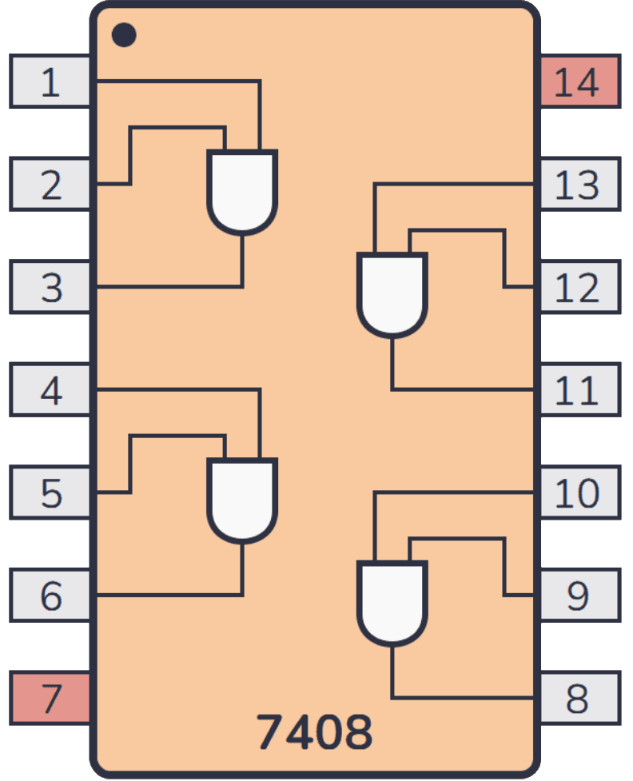

# Lab 1: Logic Gates and Truth Tables

**[Download the Lab 1 Report (PDF)](EE210L-Lab1-Report.pdf)**

Check Canvas for deliverables, deadlines, and grading rubric.

## 1. Objectives

- Identify 74LS-series logic ICs and read their pinout diagrams.
- Wire and power digital ICs correctly on a breadboard.
- Measure logic levels with a digital multimeter (DMM).
- Build truth tables experimentally for AND, OR, NOT, NAND, NOR, and XOR.
- Show that NAND is a universal gate.

## 2. Equipment and Parts

- Breadboard and jumper wires
- DC power supply
- Digital multimeter (DMM)
- Resistor kit
- ICs: 74LS08 (AND), 74LS32 (OR), 74LS04 (NOT), 74LS00 (NAND), 74LS02 (NOR), 74LS86 (XOR)

## 3. Background

### 3.1 Logic Levels

The 74LS family runs on a 5 V supply. A digital signal is not just "on" or "off". It is a
voltage that falls into one of three bands:

| Band | Voltage | Meaning |
|---|---|---|
| Logic HIGH (1) | ≥ 2.0 V at an input, ≥ 2.7 V at an output | Valid 1 |
| Undefined | 0.8 V – 2.0 V | Not a valid logic level |
| Logic LOW (0) | ≤ 0.8 V at an input, ≤ 0.5 V at an output | Valid 0 |

Notice the gap between the input and output thresholds. A gate output drives well past
what the next gate needs to see, and that margin is what makes digital logic tolerant of
noise. When you measure a gate output in this lab you will get something like 3.4 V or
0.2 V, not exactly 5 V or 0 V. Both are perfectly valid.

### 3.2 Reading a DIP Package

All ICs in this lab are 14-pin dual in-line packages (DIP-14). One end of the package has
a **notch** (and often a dot next to pin 1). With the notch to your left and the writing
facing up, pin 1 is the lower-left pin. Numbering runs counterclockwise: down the bottom
row from left to right, then back along the top row from right to left.

On every 14-pin IC in this lab:

- **Pin 7 = GND**
- **Pin 14 = V_CC (+5 V)**

Both must be connected or the chip will not work. The gates do not get power from their
inputs.

### 3.3 Pinouts

```
        74LS08 (AND)  ·  74LS32 (OR)  ·  74LS86 (XOR)  ·  74LS00 (NAND)
                        (all four share this layout)
                        ┌───────∪───────┐
                 1A  1 ─┤               ├─ 14  V_CC
                 1B  2 ─┤               ├─ 13  4B
                 1Y  3 ─┤               ├─ 12  4A
                 2A  4 ─┤               ├─ 11  4Y
                 2B  5 ─┤               ├─ 10  3B
                 2Y  6 ─┤               ├─  9  3A
                GND  7 ─┤               ├─  8  3Y
                        └───────────────┘
```

```
                          74LS02 (NOR)
              CAUTION: outputs come FIRST on this chip
                        ┌───────∪───────┐
                 1Y  1 ─┤               ├─ 14  V_CC
                 1A  2 ─┤               ├─ 13  4Y
                 1B  3 ─┤               ├─ 12  4A
                 2Y  4 ─┤               ├─ 11  4B
                 2A  5 ─┤               ├─ 10  3Y
                 2B  6 ─┤               ├─  9  3A
                GND  7 ─┤               ├─  8  3B
                        └───────────────┘
```

```
                        74LS04 (Hex Inverter)
                        ┌───────∪───────┐
                 1A  1 ─┤               ├─ 14  V_CC
                 1Y  2 ─┤               ├─ 13  6A
                 2A  3 ─┤               ├─ 12  6Y
                 2Y  4 ─┤               ├─ 11  5A
                 3A  5 ─┤               ├─ 10  5Y
                 3Y  6 ─┤               ├─  9  4A
                GND  7 ─┤               ├─  8  4Y
                        └───────────────┘
```

`A` and `B` are inputs, `Y` is the output. The leading number selects which gate on the
chip you are using. `1A`, `1B`, and `1Y` are the three pins of gate 1.

The 74LS02 pin order is the classic wiring mistake in this lab. Check it twice.

### 3.4 Floating Inputs

An unconnected TTL input is called a **floating** input. It tends to behave like a logic 1,
but it is not reliable. It picks up noise from your hand, nearby wires, and the bench.

**Every input you are using must be wired to either +5 V or GND.** Never leave an input
you care about dangling in the air.

### 3.5 Applying Inputs and Reading Outputs

To apply a logic level to an input, move a jumper wire between the +5 V rail (logic 1) and
the GND rail (logic 0).

To read an output, put the DMM in DC voltage mode with the black lead on GND and the red
lead on the output pin. Convert the reading to a logic level using the table in §3.1.

## 4. Pre-Lab

**Bring your logic ICs, breadboard, DMM, and parts kit to lab.**

Complete the pre-lab before you arrive. There is nothing to submit: show me your work at the
start of lab. It must be **hand-written and hand-drawn** in a physical notebook or notepad.

1. Write out the truth tables for 2-input AND, OR, NAND, NOR, and XOR, and for NOT.
2. Using only NAND gates, sketch a circuit for NOT, one for AND, and one for OR. You will
   build these in §5.6.
3. Draw the pinout of each IC you will use in this lab, showing the logic gates inside the
   package along with V_CC and GND. The pin numbers are listed in §3.3; your drawing should
   add the gate symbols and show which pins connect to which gate, as in the example below.



There are six ICs to draw: the 74LS00, 74LS02, 74LS04, 74LS08, 74LS32, and 74LS86. Remember
that the 74LS02 does not follow the same input/output order as the others, and that the
74LS04 has six inverters rather than four two-input gates.

## 5. Lab Work

### 5.1 Power Supply Setup

1. With the supply **off**, set it to 5.0 V and set the current limit to about 250 mA. Ask
   your instructor if you are unsure how to set a current limit on your supply.
2. Turn the supply on, measure the output with the DMM, and record the actual voltage.
   Turn the supply back off.
3. Connect the supply to the breadboard power rails: +5 V to the red rail, ground to the
   blue rail.

> **Build every circuit with the power supply off.** Turn it on only after you have
> checked your wiring.

### 5.2 First Circuit: AND Gate (74LS08)

1. Place the 74LS08 across the center channel of the breadboard, straddling the gap.
2. Wire **pin 14 to +5 V** and **pin 7 to GND**.
3. Wire inputs `1A` (pin 1) and `1B` (pin 2) to the rails using two jumper wires. Start
   with both at GND.
4. Turn on the supply. Measure the voltage at output `1Y` (pin 3) with the DMM and record
   it.
5. Step through all four input combinations by moving the two input jumpers. For each row,
   record the measured output voltage and the logic level it corresponds to.
6. Compare against the AND truth table from your pre-lab.

### 5.3 OR, NOT, NAND, NOR, XOR

Repeat the procedure of §5.2 for each of the remaining gates. For each chip: power it,
drive the inputs from the rails, and record measured output voltage and logic level for
every input combination.

| Gate | Chip | Inputs | Output | Rows to record |
|---|---|---|---|---|
| OR | 74LS32 | pins 1, 2 | pin 3 | 4 |
| NOT | 74LS04 | pin 1 | pin 2 | 2 |
| NAND | 74LS00 | pins 1, 2 | pin 3 | 4 |
| NOR | 74LS02 | pins **2, 3** | pin **1** | 4 |
| XOR | 74LS86 | pins 1, 2 | pin 3 | 4 |

Turn the power off whenever you swap a chip.

### 5.4 Undefined Region

With the 74LS08 powered and one input tied HIGH, disconnect the other input so it floats.
Measure and record the voltage at that floating input pin and at the output. Note in your
report what the output does and whether the floating input sits in the valid HIGH band,
the valid LOW band, or the undefined band from §3.1.

### 5.5 Propagation of a Real Signal

Chain two inverters on the 74LS04: drive `1A` (pin 1) from the rails, connect `1Y`
(pin 2) to `2A` (pin 3), and measure `2Y` (pin 4). Record the measured voltage at pin 1,
pin 2, and pin 4 for both input states. Note in your report how the voltage levels are
restored at each stage rather than degrading.

### 5.6 NAND as a Universal Gate

Using **only** the 74LS00, build each of the following from your pre-lab sketches and
record a full truth table for each:

1. **NOT**: tie both inputs of one NAND gate together and drive them from a single wire.
2. **AND**: a NAND followed by a NAND-wired inverter.
3. **OR**: invert both inputs with NAND-wired inverters, then feed both into a NAND.

You have four NAND gates on the chip, which is exactly enough for the OR circuit. For each
circuit, record the truth table and confirm it matches the gate you were trying to build.

### 5.7 Shut Down

Turn off the supply, disconnect the leads, and return the ICs to your kit.

## 6. Report

Fill in the report and hand it in at the end of the lab.

Your report must include, for every gate in §5.2–§5.3, the measured output voltage and the
logic level for every input combination, plus the results from §5.4, §5.5, and §5.6.
