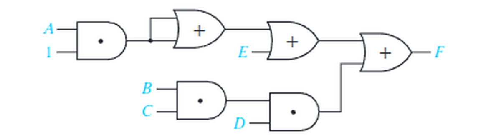
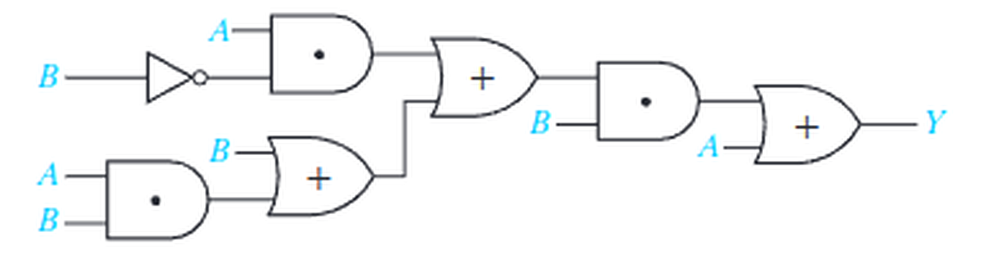

# Lab 2: Boolean Simplification

**[Download the Lab 2 Report (PDF)](EE210L-Lab2-Report.pdf)**

Check Canvas for deliverables, deadlines, and grading rubric.

## 1. Objectives

- Find the output of a multi-gate circuit by working through it one gate at a time.
- Simplify a Boolean expression using the identity, idempotent, and absorption laws.
- Build a circuit and its simplified equivalent and confirm by measurement that the two
  produce the same output for every input combination tested.
- Count the gates and packages that simplification saves.

## 2. Equipment and Parts

- Breadboard and jumper wires
- DC power supply
- Digital multimeter (DMM)
- ICs: 74LS08 (AND), 74LS32 (OR), 74LS04 (NOT)

## 3. Background

### 3.1 Why Simplify

Two circuits that produce the same output for every input combination are the same function,
no matter how different they look on paper. Simplification finds the cheapest circuit for a
function you have already specified. Fewer gates means fewer packages, less power, fewer wires
to get wrong, and lower cost when the design is built a million times.

This lab makes the claim testable. You will build a circuit, then build its simplified form,
and measure both.

### 3.2 The Laws You Need

Everything in this lab follows from these. `X` and `Y` stand for any expression, not just a
single variable.

| Law | Form | What it does here |
|---|---|---|
| Identity | `X · 1 = X` | An AND gate with one input tied HIGH passes the other input through |
| Identity | `X + 0 = X` | An OR gate with one input tied LOW passes the other input through |
| Idempotent | `X + X = X` | An OR gate with both inputs from the same node does nothing |
| Idempotent | `X · X = X` | Likewise for AND |
| Absorption | `X + XY = X` | A term that already contains `X` adds nothing to `X` |
| Absorption | `X + X′Y = X + Y` | The complement inside the product drops out |
| Absorption | `(X + Y) · X = X` | The dual form |

Work in this order and the algebra stays short: apply identity laws first to remove constants,
then look for repeated signals, then look for absorption.

### 3.3 Working Through a Circuit Gate by Gate

Do not try to read the whole circuit at once. Start at the left, write the output expression on
each gate's output wire, and carry those expressions forward. **Simplify as you go**: an
expression you shorten early stays short through everything downstream, while one you leave
messy grows at every stage.

Watch for two things in particular:

- **A constant on an input.** See §3.4.
- **A dot on a wire.** A dot marks a connection, so one gate output can drive several inputs.
  If both inputs of a gate come from the same dot, they carry the same signal.

### 3.4 Constants on a Schematic

An input drawn as `1` is a fixed logic HIGH: **wire it to +5 V.** An input drawn as `0` is a
fixed logic LOW: **wire it to ground.**

Never leave a constant input disconnected. An unconnected TTL input floats and behaves
unreliably, exactly as you measured in Lab 1 §5.4.

### 3.5 Recording Logic Levels

In Lab 1 you measured output voltages and converted each to a logic level. You have made that
point, so in this lab **record only the logic level, 0 or 1.**

Read the output the same way: DMM in DC voltage mode, black lead on ground, red lead on the
output pin, then convert using the bands from Lab 1 §3.1. A reading that lands in the undefined
band between 0.8 V and 2.0 V is not a logic level. It means something is wired wrong, and the
most common cause is a missing power or ground connection on a chip you are using.

### 3.6 Pinouts

```
              74LS08 (AND)  ·  74LS32 (OR)
              (both share this layout)
                    ┌───────∪───────┐
             1A  1 ─┤               ├─ 14  V_CC
             1B  2 ─┤               ├─ 13  4B
             1Y  3 ─┤               ├─ 12  4A
             2A  4 ─┤               ├─ 11  4Y
             2B  5 ─┤               ├─ 10  3B
             2Y  6 ─┤               ├─  9  3A
            GND  7 ─┤               ├─  8  3Y
                    └───────────────┘
```

```
                  74LS04 (Hex Inverter)
                    ┌───────∪───────┐
             1A  1 ─┤               ├─ 14  V_CC
             1Y  2 ─┤               ├─ 13  6A
             2A  3 ─┤               ├─ 12  6Y
             2Y  4 ─┤               ├─ 11  5A
             3A  5 ─┤               ├─ 10  5Y
             3Y  6 ─┤               ├─  9  4A
            GND  7 ─┤               ├─  8  4Y
                    └───────────────┘
```

`A` and `B` are inputs, `Y` is the output. The leading number selects which gate on the chip you
are using. On every 14-pin chip here, **pin 7 is GND and pin 14 is V_CC**, and both must be
connected or the chip will not work.

## 4. Pre-Lab

**Bring your ICs, breadboard, DMM, and parts kit to lab.**

Complete the pre-lab before you arrive. There is nothing to submit: show me your work at the
start of lab. It must be **hand-written and hand-drawn** in a physical notebook.

These are the two circuits you will analyze and build.

**Circuit (a)**



**Circuit (b)**



1. For circuit (a), write the output expression of **every** gate, going from left to right, and
   simplify as you go. State the final output `F` in its simplest form, and name the law you used
   at each step where you simplified.
2. Draw the simplified circuit for (a) using AND, OR, and NOT gates. Label every gate with the
   chip and the pin numbers you intend to use.
3. For circuit (b), do the same: the output of every gate, and `Y` in its simplest form, with the
   law named at each step.
4. Draw the simplified circuit for (b), labelled with chip and pin numbers.
5. Using your simplified expressions, **predict the output** for every row of the two tables in
   §5.2 and §5.4. You will compare your measurements against these predictions in lab.

> Circuit (b) simplifies much further than it first appears. If your answer still has several
> gates in it, check for absorption before you start wiring.

## 5. Lab Work

### 5.1 Power Supply Setup

1. With the supply **off**, set it to 5.0 V and set the current limit to about 250 mA.
2. Turn the supply on, measure the output with the DMM, and record the actual voltage. Turn the
   supply back off.
3. Connect the supply to the breadboard power rails: +5 V to the red rail, ground to the blue
   rail.

> **Build every circuit with the power supply off.** Turn it on only after you have checked your
> wiring.

### 5.2 Circuit (a): Original

1. Power off. Place the 74LS08 and the 74LS32 on the board. Wire **pin 14 to +5 V and pin 7 to
   GND on both chips.**
2. Build circuit (a) exactly as drawn. It takes three AND gates from the 74LS08 and three OR
   gates from the 74LS32.
3. The second input of the first AND gate is the constant `1`. Tie it to **+5 V** (§3.4).
4. The first OR gate takes both of its inputs from the same node. Run **two** jumper wires from
   that node, one to each input pin. Do not leave the second input open.
5. Bring `A`, `B`, `C`, `D`, and `E` out to five jumper wires you can move between the rails.
6. Power on and record the output `F` as a logic level for each of these five combinations.

   | # | A | B | C | D | E |
   |---|---|---|---|---|---|
   | 1 | 0 | 0 | 0 | 0 | 0 |
   | 2 | 1 | 0 | 0 | 0 | 0 |
   | 3 | 0 | 0 | 0 | 0 | 1 |
   | 4 | 0 | 1 | 1 | 1 | 0 |
   | 5 | 0 | 1 | 1 | 0 | 0 |

7. Compare each measured output against the value you predicted in the pre-lab. If any row
   disagrees, find the wiring error before moving on. A disagreement is a wiring fault, not a
   flaw in the algebra.

> These five rows are not arbitrary. Rows 2, 3, and 4 each turn the output on through a
> different path, and row 5 is a near miss that differs from row 4 by one input. Together they
> exercise every part of the circuit.

### 5.3 Circuit (a): Simplified

1. Power off. Take the original circuit apart and build the simplified circuit you drew in the
   pre-lab.
2. Power on and record `F` for the **same five combinations** as §5.2.
3. Confirm every row matches what you measured in §5.2. If a row differs, either the circuit is
   miswired or the simplification is wrong. Check the wiring first, then recheck the algebra.

### 5.4 Circuit (b): Original

1. Power off. Add the 74LS04 to the board, **pin 14 to +5 V and pin 7 to GND.**
2. Build circuit (b) as drawn. It takes one inverter from the 74LS04, three AND gates from the
   74LS08, and three OR gates from the 74LS32.
3. This circuit has only two inputs, `A` and `B`, so there are only four possible input
   combinations. Bring `A` and `B` out to two jumper wires.
4. Power on and record `Y` as a logic level for all four combinations.

   | # | A | B |
   |---|---|---|
   | 1 | 0 | 0 |
   | 2 | 0 | 1 |
   | 3 | 1 | 0 |
   | 4 | 1 | 1 |

5. Compare each measured output against your pre-lab prediction.

### 5.5 Circuit (b): Simplified

1. Power off. Take the original circuit apart and build the simplified circuit you drew in the
   pre-lab.
2. Power on and record `Y` for all four combinations.
3. Confirm every row matches §5.4.

### 5.6 Gate and Chip Count

With both circuits still fresh, count what simplification bought you. For each of the four
circuits you built, record the number of gates used and the number of packages needed.

Note in your report how many gates the simplified version of circuit (b) needs, and compare it
against the seven in the original.

### 5.7 Shut Down

Turn off the supply, disconnect the leads, and return the ICs to your kit.

## 6. Report

Fill in the report and hand it in at the end of the lab.

Your report must include, for both circuits, the measured output of the original and of the
simplified version for every input combination listed, along with your simplified expressions
and the gate and package counts from §5.6.
