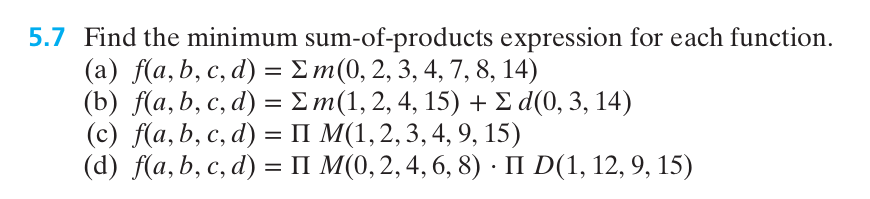
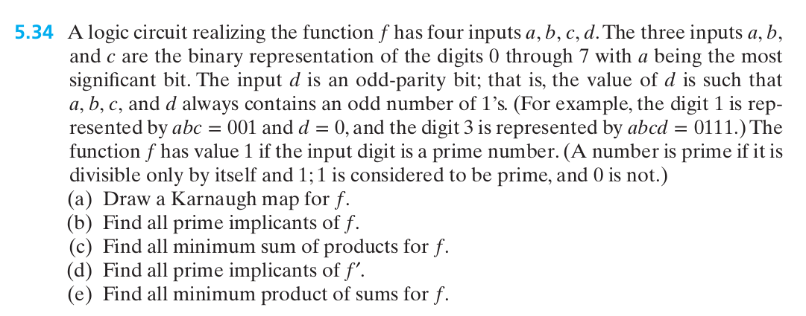

# Lab 4: Karnaugh Maps

**[Download the Lab 4 Report (PDF)](EE210L-Lab4-Report.pdf)**

Check Canvas for deliverables, deadlines, and grading rubric.

## 1. Objectives

- Fill a Karnaugh map from a truth table or a minterm list, in Gray code order.
- Group adjacent cells and read a minimal sum-of-products expression off the map.
- Use don't-care conditions to make a function smaller than the algebra of Lab 2 can.
- Recognize that a minimum expression is not always unique.
- Build minimized circuits and confirm them against every input combination that can occur.

## 2. Equipment and Parts

- Breadboard and jumper wires
- DC power supply
- Digital multimeter (DMM)
- ICs: 74LS08 (AND), 74LS32 (OR), 74LS04 (NOT)

## 3. Background

### 3.1 Why a Map

In Lab 2 you simplified by applying laws. That works, but it has two problems. You have to spot
which law applies, and you never know when to stop. In Lab 3 you saw the cost of not
simplifying at all.

A **Karnaugh map** removes both problems. It is the same truth table, rearranged so that
simplification becomes something you see instead of something you derive. Every pair of adjacent
cells differs in exactly one variable, which is precisely the condition the combining law

```
X·Y + X·Y′ = X
```

requires. Grouping cells on the map *is* applying that law, and the map shows you every place it
applies at once.

### 3.2 Gray Code Order

The column and row labels are **not** in counting order. They run 00, 01, 11, 10, so that only
one bit changes between neighbours. Writing them 00, 01, 10, 11 breaks the map and is the most
common mistake in this lab.

A three-variable map, with the minterm number in each cell:

```
            BC
        00   01   11   10
      ┌────┬────┬────┬────┐
 A=0  │ m0 │ m1 │ m3 │ m2 │
      ├────┼────┼────┼────┤
 A=1  │ m4 │ m5 │ m7 │ m6 │
      └────┴────┴────┴────┘
```

A four-variable map:

```
            CD
        00   01   11   10
      ┌────┬────┬────┬────┐
 00   │ m0 │ m1 │ m3 │ m2 │
      ├────┼────┼────┼────┤
 01   │ m4 │ m5 │ m7 │ m6 │
 AB   ├────┼────┼────┼────┤
 11   │m12 │m13 │m15 │m14 │
      ├────┼────┼────┼────┤
 10   │ m8 │ m9 │m11 │m10 │
      └────┴────┴────┴────┘
```

**The edges wrap.** The left column is adjacent to the right column, and the top row is adjacent
to the bottom row. On the four-variable map, `m0`, `m2`, `m8`, and `m10` form a legal group of
four, even though they sit in the corners.

### 3.3 Grouping Rules

1. Groups contain 1, 2, 4, 8, or 16 cells. Never 3, never 6.
2. Groups are rectangles, counting wrap-around. No L shapes.
3. Make every group **as large as possible**. A larger group means fewer literals in its term.
4. Use as **few groups** as possible, but every 1 must be covered by at least one group.
5. Groups may overlap, and a cell may be used more than once. Overlap costs nothing.

To read a term off a group, keep only the variables that stay constant across the whole group.
A variable that is 1 throughout appears plain; one that is 0 throughout appears complemented;
one that changes drops out. A group of size 2ᵏ drops `k` variables.

### 3.4 Don't-Care Conditions

Some input combinations can never occur. A code may be forbidden by the system that generates
it, or the inputs may be physically unable to produce it. For those rows the output does not
matter, and they are marked `X` on the map instead of 0 or 1.

A don't-care is free to use. **Treat it as a 1 when doing so makes a group bigger, and as a 0
otherwise.** You are not obliged to cover it, and there is no penalty for leaving it out.

This is the one thing the laws of Lab 2 cannot do for you. Algebra has no way to exploit a row
whose value you are free to choose, because you must commit to a value before you can simplify.
The map lets you decide group by group, and the saving is often large.

### 3.5 Minimum Is Not Unique

A function can have more than one minimal expression, with the same number of terms and the same
number of literals, differing in which cells are grouped. All of them are correct and all cost
the same. Finding a different answer from your partner does not mean one of you is wrong, and
§5.4 asks you to confirm this on a real function.

### 3.6 Recording Logic Levels

As in Labs 2 and 3, record only the logic level, 0 or 1. Read the output with the DMM, black
lead on ground, red lead on the output pin, and convert using the bands from Lab 1 §3.1. A
reading in the undefined band between 0.8 V and 2.0 V means something is wired wrong, most often
a missing power or ground pin.

### 3.7 Pinouts

```
      74LS08 (AND)  ·  74LS32 (OR)
           (both share this layout)
                    ┌───────∪───────┐
             1A  1 ─┤               ├─ 14  V_CC
             1B  2 ─┤               ├─ 13  4B
             1Y  3 ─┤               ├─ 12  4A
             2A  4 ─┤               ├─ 11  4Y
             2B  5 ─┤               ├─ 10  3B
             2Y  6 ─┤               ├─  9  3A
            GND  7 ─┤               ├─  8  3Y
                    └───────────────┘
```

```
                  74LS04 (Hex Inverter)
                    ┌───────∪───────┐
             1A  1 ─┤               ├─ 14  V_CC
             1Y  2 ─┤               ├─ 13  6A
             2A  3 ─┤               ├─ 12  6Y
             2Y  4 ─┤               ├─ 11  5A
             3A  5 ─┤               ├─ 10  5Y
             3Y  6 ─┤               ├─  9  4A
            GND  7 ─┤               ├─  8  4Y
                    └───────────────┘
```

On every 14-pin chip here, **pin 7 is GND and pin 14 is V_CC**, and both must be connected.

## 4. Pre-Lab

**Bring your ICs, breadboard, DMM, and parts kit to lab.**

Complete the pre-lab before you arrive. It must be **hand-written and hand-drawn**. Scan or
photograph your work and **submit it on Canvas before lab begins.** Bring the original with you
to work from during lab.

Draw every map in Gray code order and circle every group you use.

Two of the three functions below are problems you have already solved for the lecture
homework. **Do not work them again.** Start from the answer you already have and do only the
parts listed here.

Logic diagrams in this pre-lab are **logic diagrams only**: gate symbols, inputs, and output. You
do not need chip or pin numbers. You will assign those at the breadboard.

**1. The majority voter, again.** In Lab 3 you simplified `M(A,B,C) = Σm(3,5,6,7)` with the
laws. Do it with a map instead. Draw the three-variable map, group it, and write the minimal SOP.
Compare it with the expression you got in Lab 3 and state whether they agree. Note how many steps
each method took.

**2. Function W.** This is **problem 5.7(d)** from the homework, part (d) only.



You already have its minimum sum-of-products answer. Carry it over and continue:

- Write the minimum SOP from your homework solution.
- Count the 2-input gates it needs, using the Lab 3 §3.4 rule that an `n`-input gate costs
  `n − 1` two-input gates. Count inverters separately.
- Draw the logic diagram for it.

**3. Function P.** This is **problem 5.34** from the homework, parts (a) and (c) only.



You already have the map and every minimum sum-of-products expression. Carry them over and
continue:

- Write the eight digits with their `abcd` codes and minterm numbers, taken from the map you
  already drew. Then list the eight codes that cannot occur and say in one sentence why not.
- Write all the minimum SOP expressions from your homework solution, and mark the one you intend
  to build.
- Count the 2-input gates for the one you marked.
- Group the map again with **every don't-care forced to 0** and count the gates that version
  would need. Do not draw it.
- Draw the logic diagram for the **version you will build only**.

**4.** Predict the output for every row of the tables in §5.2, §5.3, and §5.4.

> In Function P, all five 1s are isolated once the don't-cares are forced to 0. If you find a
> group of two in that version, you have mis-assigned a parity bit. Check your digit table before
> you count.

## 5. Lab Work

### 5.1 Power Supply Setup

1. With the supply **off**, set it to 5.0 V and set the current limit to about 250 mA.
2. Turn the supply on, measure the output with the DMM, and record the actual voltage. Turn the
   supply back off.
3. Connect the supply to the breadboard power rails: +5 V to the red rail, ground to the blue
   rail.

> **Build every circuit with the power supply off.** Turn it on only after you have checked your
> wiring.

### 5.2 Function W: What the Don't-Cares Bought You

1. Power off. Place the 74LS08 and 74LS32. Wire **pin 14 to +5 V and pin 7 to GND on each
   chip.**
2. Build `W` from your pre-lab.
3. Bring `a`, `b`, `c`, and `d` out to four jumper wires.
4. Power on and record `W` for the twelve rows below. These are the seven 1s and the five 0s.
   The four don't-care rows are deliberately absent.

   | # | a | b | c | d |
   |---|---|---|---|---|
   | 1 | 0 | 0 | 0 | 0 |
   | 2 | 0 | 0 | 1 | 0 |
   | 3 | 0 | 0 | 1 | 1 |
   | 4 | 0 | 1 | 0 | 0 |
   | 5 | 0 | 1 | 0 | 1 |
   | 6 | 0 | 1 | 1 | 0 |
   | 7 | 0 | 1 | 1 | 1 |
   | 8 | 1 | 0 | 0 | 0 |
   | 9 | 1 | 0 | 1 | 0 |
   | 10 | 1 | 0 | 1 | 1 |
   | 11 | 1 | 1 | 0 | 1 |
   | 12 | 1 | 1 | 1 | 0 |

5. Every row must match your prediction. The circuit is only required to be correct on rows that
   can occur, and all twelve of these can.
6. **Now set the four don't-care rows anyway**: `abcd` = 0001, 1001, 1100, 1111. Record what the
   circuit does. Nothing here is right or wrong. Note in your report what it happened to produce
   and why you were free to ignore it.

### 5.3 Function P: The Prime Detector

1. Power off. Take down circuit `W`. Place the 74LS04 as well, and power it.
2. Build the version of `P` you marked in the pre-lab.
3. Power on and record `P` for the eight codes that can actually occur, which are the eight rows
   of your pre-lab table.

   | # | Digit | a | b | c | d |
   |---|---|---|---|---|---|
   | 1 | 0 |  |  |  |  |
   | 2 | 1 |  |  |  |  |
   | 3 | 2 |  |  |  |  |
   | 4 | 3 |  |  |  |  |
   | 5 | 4 |  |  |  |  |
   | 6 | 5 |  |  |  |  |
   | 7 | 6 |  |  |  |  |
   | 8 | 7 |  |  |  |  |

   Fill in `a`, `b`, `c`, and `d` from your pre-lab table before you apply any inputs.

4. Check the output against the specification, not just against your prediction. `P` must be 1
   for digits 1, 2, 3, 5, and 7, and 0 for digits 0, 4, and 6.

### 5.4 Confirming That Minimum Is Not Unique

1. Power off. Rebuild `P` using a **different** one of the three minimal expressions from your
   pre-lab.
2. Power on and record the output for the same eight digits.
3. The two columns must agree on all eight. Record in your report whether they also agree on the
   eight impossible codes, and explain the result.

### 5.5 Cost Comparison

Fill in the comparison table in the report from your pre-lab gate counts.

You built only the minimized version of `P`. Note in your report how many gates and how many
packages the all-zeros version would have taken, and whether it would have fit in the chips you
have.

### 5.6 Shut Down

Turn off the supply, disconnect the leads, and return the ICs to your kit.

## 6. Report

Fill in the report and hand it in at the end of the lab.

Your report must include the minimal expressions for `M`, `W`, and `P`, every minimal form of
`P`, the measured outputs from §5.2 through §5.4, and the gate counts from §5.5. Your maps and
logic diagrams stay on the pre-lab you submitted on Canvas. Do not redraw them here.
